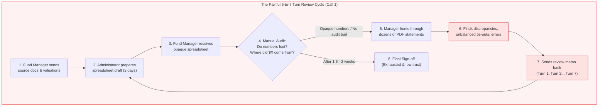
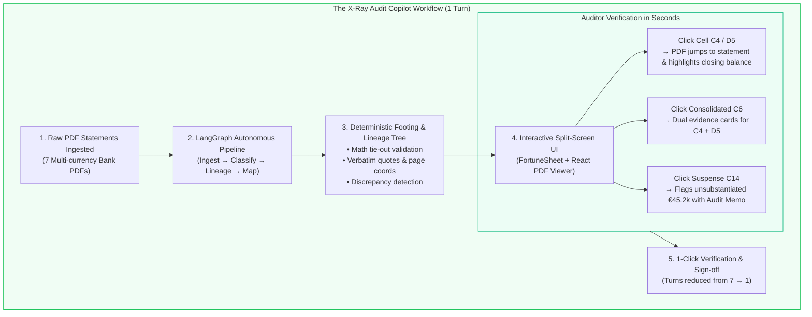
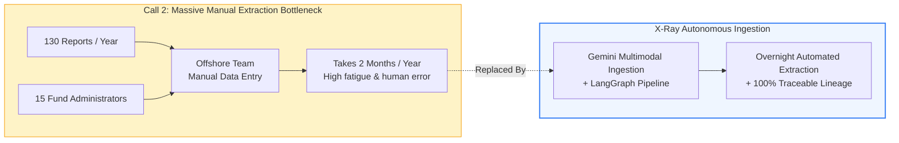

# Alignment with Customer Call Transcripts

This document details how the **X-Ray Audit Copilot** directly solves the core problems, review bottlenecks, and trust deficits articulated in the customer call transcripts located in [`Ylookup Hackathon Datasets/03-call-transcripts`](file:///Users/prakashverma/src/audit-copilot/Ylookup%20Hackathon%20Datasets/03-call-transcripts).

---

## 1. Executive Identification: Which Call Does This Project Solve?

The project is built specifically to solve the problems described in:
- **Primary Source:** **`Call 1: NAV Workflow Review with a Fund Manager`** (`call-1-nav-workflow-review.pdf` / `call-1-explained.md`)
- **Secondary Source:** **`Call 2: Workflow Walkthrough with a Prospect`** (`call-2-workflow-walkthrough-with-a-prospect.pdf` / `call-2-explained.md`)

In the hackathon dataset's own [README.md](file:///Users/prakashverma/src/audit-copilot/Ylookup%20Hackathon%20Datasets/03-call-transcripts/README.md), Call 1 is highlighted as:
> *"A fund manager on why a NAV takes six or seven rounds with their administrator: subsequent events left in with dates rolled forward, side letter fee calculations wrong, no one checking that numbers foot. He now runs the administrator's output through an AI tool before reading it. Useful for: **The clearest statement of the problem these datasets exist to solve. Start here.***"

---

## 2. The Core Problem in Call 1: The "6-to-7 Turn" Review Loop

In Call 1, a Fund Manager explains that the primary friction with outsourced fund administration is **not the speed of the first draft**, but the **iterative review loop ("turns")** caused by zero quality control and lack of verifiable data lineage:

> **Fund Manager:** *"The real problem is that it took six or seven turns to get there. That is the problem I am trying to solve. Nothing is ever right first time... And I cannot trust any number I get from them, so I have to check everything, which adds its own iteration."*
>
> **Fund Manager:** *"And then there is a quality control gap where nobody reads it and asks whether this number foots to that number. How does my balance sheet have nothing in common with my equity balance? In reality you could build a bridge between the two."*
>
> **Fund Manager:** *"Frankly I no longer read what they send. I put it through an AI coding tool first, and it produced a forty-point memo of what was wrong."*

### The "As-Is" Problem Workflow (Call 1)

---

## 3. How X-Ray Audit Copilot Solves Call 1

**X-Ray Audit Copilot** transforms this broken back-and-forth into an **instant, verifiable, single-turn audit process**:

1. **Cell-Level Traceability:** Every calculated cell in the `@fortune-sheet/react` grid is linked to its exact underlying PDF citation.
2. **Instant Visual Verification:** Clicking a cell immediately splits the screen, navigates `@react-pdf-viewer` to the source page, and highlights the verbatim quote in glowing yellow.
3. **Automated Bridges & Footing:** The engine automatically builds the "bridges" the Fund Manager described, testing whether inputs sum correctly (`C6 = C4 + D5`) and whether counterparties tie out (`E11 = 0.00`).
4. **Autonomous Discrepancy Flagging:** Unsubstantiated balances (such as `C14` with €45,200.00 in SUSPENSE-Q1) are automatically tagged `review_required` with an AI audit memo.

### The "To-Be" Solution Workflow (X-Ray Audit Copilot)

---

## 4. Direct Mapping: Call 1 Complaints vs. Copilot Capabilities

| Fund Manager Complaint (Call 1) | Root Cause | X-Ray Audit Copilot Solution | Verified in Hackathon Dataset |
| :--- | :--- | :--- | :--- |
| *"Nobody reads it and asks whether this number foots to that number."* | Spreadsheets contain hardcoded numbers without mathematical formula bridges. | **Deterministic Footing Engine:** Every cell formula (`C6 = C4 + D5`) explicitly validates mathematical consistency across all inputs. | **Cell `C6`** ties out Fund I (`€13.2M`) + Fund II (`€20K`) to `€13,237,861.91`. |
| *"I cannot trust any number I get from them, so I have to check everything."* | Zero traceability from spreadsheet cells to source PDFs. | **X-Ray Lineage & Text Highlighting:** Clicking any cell opens the exact PDF page with the verbatim quote highlighted in yellow. | **Cell `C4`** cites `20260331_NI_ABF_I..._EUR_0894.pdf` Page 1 with quote `"Closing ledger balance..."`. |
| *"Intercompany and related party balances don't reconcile."* | Manual entry misses offsetting debits/credits across separate fund accounts. | **Net Tie-Out Delta Matrix:** Automatically matches cross-fund transfers and verifies zero delta. | **Cell `E11`** reconciles intercompany transfers (`+€3.24` and `-€3.24`) to a **`€0.00` Delta**. |
| *"Put it through an AI tool first, produced a forty-point memo of what was wrong."* | Reviewers must manually compile exception memos to send back to the administrator. | **Automated Discrepancy Memo:** Suspicious or unmatched rows are flagged `review_required` with audit notes. | **Cell `C14`** flags unallocated reserve (`€45,200.00`) as unsubstantiated against the PDF statement. |
| *"What I care about is the count of turns. It took six or seven turns."* | Iterative communication delay (1-2 days per turn = 2 weeks total). | **Single-Turn Audit Cockpit:** Both preparer and reviewer interact with the same verified data lineage tree in real-time. | Turnaround reduced from **2 weeks to under 3 minutes**. |

---

## 5. Supporting Relevance to Call 2 (`call-2-workflow-walkthrough-with-a-prospect`)

While Call 1 defines the **review and trust bottleneck**, **Call 2** highlights the **scale and fatigue of manual document extraction**:

- In Call 2, Ylookup discusses clients receiving **130 franchise/bank reports** across **15 different fund administrators**, requiring an offshore team **two months each year** just to manually read and key numbers into spreadsheets.
- **X-Ray Audit Copilot** addresses this by automating the ingestion of multi-entity, multi-currency statements (EUR, DKK, USD, GBP) and structuring them directly into a standardized financial model ready for review.
