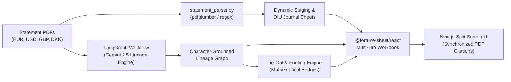

# X-Ray Audit Copilot 🔍
### Autonomous Financial Data Lineage, Automated Multi-Fund Reconciliation & Character-Grounded Audit Trail
> **Ylookup × Encode AI Hackathon — Product Track**  
> *Bringing software engineering & zero-hallucination verification to the $30T private markets industry.*

---

## ⚡ Quick Start (One Command to Run)

Clone the repository:

```bash
git clone https://github.com/prkshverma09/audit-copilot.git
cd audit-copilot
```

### Option A: Turnkey Docker Deployment (Recommended for Judges 🐳)
Run everything in isolated containers with zero dependency setup:

```bash
./run_docker.sh
# or
docker compose up --build
```

### Option B: Local Native Deployment (Without Docker)
```bash
./start_all.sh
```

- **Frontend Application:** [http://localhost:3000](http://localhost:3000)
- **Backend FastAPI API:** [http://localhost:8000](http://localhost:8000)
- **Interactive Swagger Docs:** [http://localhost:8000/docs](http://localhost:8000/docs)

---

## 🎯 1. Problem Identification (25% Criteria)

### The Real Problem from Customer Interviews
In **Call 1: NAV Workflow Review with a Fund Manager** (`call-1-nav-workflow-review.pdf`), the Fund Manager articulated the fundamental breakdown in fund administration:

> *"The real problem is that it took **six or seven turns** to get there. That is the problem I am trying to solve. Nothing is ever right first time... And I cannot trust any number I get from them, so I have to check everything, which adds its own iteration."*
>
> *"And then there is a quality control gap where **nobody reads it and asks whether this number foots to that number**. How does my balance sheet have nothing in common with my equity balance? In reality you could build a bridge between the two."*
>
> *"Frankly I no longer read what they send. I put it through an AI coding tool first, and it produced a forty-point memo of what was wrong."*

### Why the Status Quo Fails
1. **The "Opaque Spreadsheet" Problem**: Fund admins send Excel spreadsheets with static values. The fund manager has no idea where numbers came from without digging through dozens of 50-page PDF bank statements.
2. **The "Broken Math" Problem**: Nobody verifies vertical footings or cross-fund intercompany settlements before sending drafts, forcing the fund manager to act as a manual QA auditor.
3. **The "Hallucination Risk"**: Generic LLMs hallucinate financial balances. Fund accountants cannot trust AI outputs without verifiable evidence citations.

*For our full analysis, see [CALL_TRANSCRIPT_ALIGNMENT.md](CALL_TRANSCRIPT_ALIGNMENT.md).*

---

## 🚀 2. The Solution: What We Built (25% Criteria)

**X-Ray Audit Copilot** collapses the painful "6-to-7 turn" review loop into a **verifiable, single-turn audit process**:

1. **Live Character-Grounded Lineage**: Clicking any cell in the `@fortune-sheet/react` workbook instantly splits the screen, loads the exact statement PDF, jumps to the exact page, and highlights the verbatim quote in glowing yellow.
2. **Automated Multi-Fund Reconciliation Engine**: Builds mathematical verification bridges across funds (e.g., verifying that Fund I cash + Fund II cash = Consolidated cash, and intercompany transfers net to `€0.00`).
3. **Automated Exception Detection**: Flags unallocated items (like `SUSPENSE-Q1` €45,200.00) with `⚠️ Review Required` and generates audit commentary explaining the variance.
4. **Dynamic Statement Ingestion to Multi-Tab Workpaper**: Uploading raw PDF statements automatically synthesizes:
   - **`Fund Cash Reconciliation`**: Primary cross-fund matrix and consolidation balance.
   - **`Staging Sheet`**: Transaction-level detail dynamically parsed from all uploaded statements.
   - **`DIU (Journal Entries)`**: Balanced double-entry accounting legs tied to the chart of accounts.
   - **`Chart of Accounts`**: Master fund accounting taxonomy.

---

## 🎨 3. UI Excellence & User Experience (25% Criteria)

- **Auditor-Grade Split-Pane View**: Excel workbook on the left, interactive PDF document viewer on the right with resizable split-pane.
- **Formula & Lineage Ribbon**: Displays the active cell, account description, calculation status (`✓ Fully Reconciled` or `⚠️ Review Required`), and instant deep links.
- **Reconciliation Engine Modal**: Executive scorecard displaying mathematical equations, component terms, source documents, and zero-variance compliance.
- **Interactive Canvas Overlays**: Custom Canvas rendering draws visual audit indicators directly onto sheet cells without interfering with standard spreadsheet navigation.
- **Zero AI Slop**: Clean, high-density dark-mode interface designed for finance professionals.

---

## 🏗️ 4. Architecture & Code Quality (25% Criteria)



### Key Components
- **Backend (`/backend`)**:
  - `app/graph/workflow.py`: Multi-stage LangGraph pipeline for document classification, lineage extraction, and reconciliation.
  - `app/core/statement_parser.py`: Robust PDF statement parser extracting transaction dates, amounts, narratives, and journal entry legs.
  - `app/core/tieout_engine.py`: Deterministic accounting engine evaluating consolidation bridges, footing deltas, and zero-variance compliance.
  - `app/api/v1/`: Modular FastAPI endpoints for documents, lineage, spreadsheet models, and tie-out verification.
- **Frontend (`/frontend`)**:
  - `src/components/sheet/SpreadsheetView.tsx`: FortuneSheet grid integration with custom canvas-layer audit decorators.
  - `src/components/sheet/TieOutBridgeModal.tsx`: Interactive reconciliation inspector.
  - `src/components/viewer/PdfViewer.tsx`: High-performance PDF renderer with automated keyword highlighting and bounding-box synchronization.
  - `src/components/layout/Header.tsx`: Executive scorecard with real-time audit confidence meter.

---

## 🧪 Verification & Test Suite

The repository includes end-to-end test suites verifying both the backend API and frontend interactive audit trail:

```bash
# 1. Run live backend verification on real hackathon dataset statements
./backend/.venv/bin/python backend/tests/test_all_apis_real_data.py

# 2. Run Playwright interactive audit trail verification
node frontend/scripts/test_interactive_audit_trail.mjs
```

---

## 👥 Submission Details

- **Hackathon:** Ylookup × Encode AI Hackathon (Shoreditch, London)
- **Track:** Product Track (Private Markets & Fund Administration)
- **Primary Source:** Call 1 (`call-1-nav-workflow-review.pdf`)
- **Dataset Utilized:** `01-bank-statements-to-journal-entries` (7 statement PDFs across EUR, USD, GBP, DKK)
