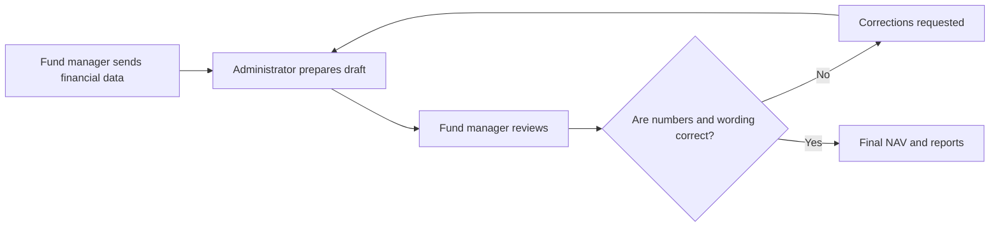
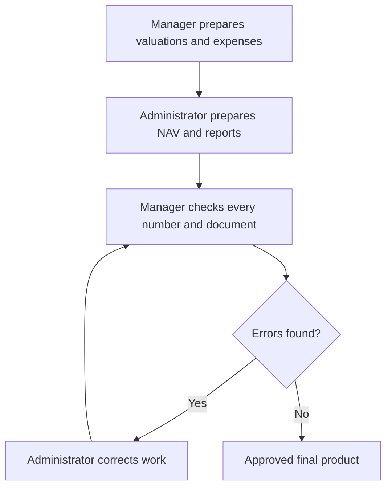

# Call 1: NAV Workflow Review

## Simple Summary

This call is about a fund manager who is unhappy with the quality of work from an outsourced fund administrator.

The administrator prepares the fund's NAV, financial statements, and investor reports. The work is rarely correct the first time, so the fund manager has to send it back repeatedly.

The main problem is not how long one review takes. The problem is the number of correction cycles, or **turns**. This NAV took six turns; normally it takes about three.



## What Goes Wrong?

### Financial statements are updated mechanically

A deal happened after the previous financial year ended. It should have moved from the **subsequent events** section into the **portfolio companies** section.

Instead, the first draft left the deal in the old section and mostly just rolled the date forward by a year. The surrounding text was not rewritten, so the document still read as though the deal belonged in the old context.

This is an example of a small change that creates many related wording and classification errors.

### Investor calculations ignore a side letter

One investor had a side letter saying that their management fee should reduce their called capital. The administrator repeatedly calculated this incorrectly.

A senior manager eventually had to explain the rule and how it should flow through the calculation before the report was corrected.

### Related numbers are not reconciled

The manager says nobody checks whether one figure explains another. For example, the balance sheet should connect logically to the equity balance.

A **bridge** is a calculation that explains the movement from one number to another:

```text
Opening balance
+ Contributions
- Distributions
+ Investment gains or losses
- Expenses
= Closing balance
```

The manager's AI review tool builds these bridges, sometimes working backwards from the final number. The administrator is not doing that quality check.

## Why Is This Happening?

The manager says the problem is not a lack of data. The fund is relatively simple:

- 30 investors
- 29 investors with almost identical terms
- 1 general partner
- The relevant documents already exist

The difficulty is processing the information correctly and applying it consistently. The important sources include:

- The partnership agreement
- Investor side letters
- Portfolio activity
- Subsequent events
- Valuations
- Expense records

There is also a quality-control gap: nobody reviews the final output as a connected set of numbers and documents.

## Who Does What?

The fund manager handles the parts that require specific context:

- Investment valuations
- Expense reconciliation
- Deciding whether expenses belong to the management company, the fund, or portfolio companies

The administrator uses that information to prepare the NAV, financial statements, and investor reports. The manager then checks everything and sends corrections back.



## What Does "Six Turns" Mean?

A turn is one round of sending work back and forth:

1. The administrator sends a first draft.
2. The manager finds obvious errors.
3. The administrator sends a correction.
4. A deeper review finds another major problem.
5. The administrator fixes that problem.
6. The final review is completed.

Each turn takes about one to two days. The manager is not mainly concerned with whether a particular turn takes one hour or 48 hours. The important measure is the number of turns, because each one consumes management time.

## The Main Business Opportunity

Ylookup is proposing software that acts as an automated quality-control reviewer. It would:

- Read the fund's source documents
- Understand the fund's rules
- Apply side-letter terms
- Check calculations
- Reconcile related numbers
- Identify inconsistent wording
- Find errors before the administrator sends the work back

The desired result is:

```text
Fewer errors
    -> Fewer review turns
    -> Less manager time spent checking
    -> More confidence in investor reporting
```

## Main Takeaway

The fund manager does not mainly want faster processing. They want correct work on the first or second attempt.

This transcript covers roughly the first third of the call, so it may not include the full product demonstration or all of the manager's feedback.
