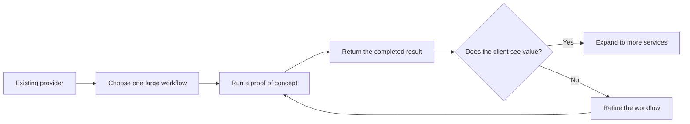
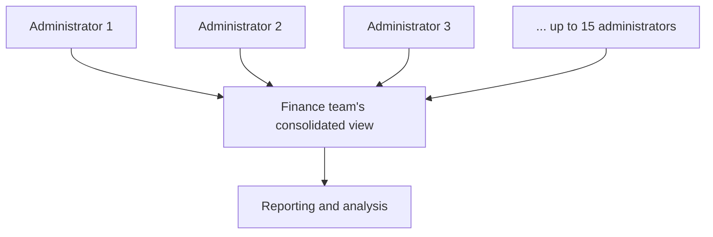
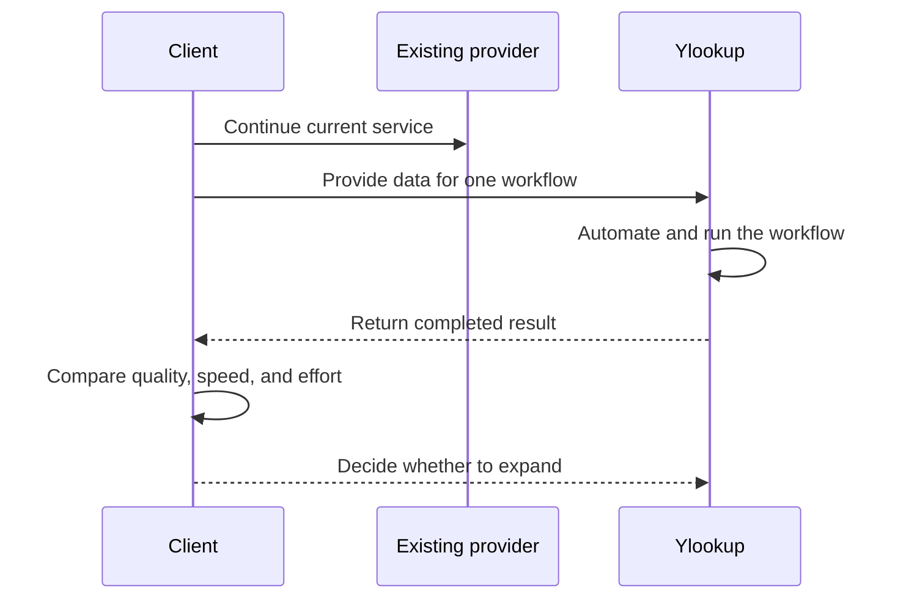

# Call 2: Workflow Walkthrough With a Prospect

## Simple Summary

This call explains how Ylookup approaches automation for financial operations and outsourced fund-administration work.

Ylookup says a client does not need to replace its entire provider at once. It can start with one service or one workflow, prove that the work can be done better, and then expand.



## What Examples Are Discussed?

### Small extraction tasks

Ylookup mentions smaller jobs such as extracting CRS data. These tasks may look simple, but they can still consume staff time when repeated across many documents or entities.

### Reading many franchise reports

One investor receives about 130 franchise reports every year. An offshore team reads the reports and updates the investor's numbers. That work takes about two months each year.

Ylookup says an automated workflow could run the same job overnight. The value is not only that the computer is faster. It also frees the offshore team from repetitive reading and data-entry work.

### Consolidating data from many administrators

A finance team may need to consolidate information from 15 different fund administrators. Doing this manually is difficult because the information may arrive in different formats and follow slightly different processes.



## The Prospect's Concern

The prospect asks an important practical question: what happens when a client already has a contract with an existing administrator whose services are bundled together?

Would the client be willing to run Ylookup alongside that provider, or would the client have to cancel the existing agreement first?

## Ylookup's Answer: Start With a Proof of Concept

Ylookup says the first step is a **proof of concept**, often shortened to POC. The team chooses a substantial workflow, such as NAV valuation, runs it, and hands the result back to the prospective client.

This approach lowers the barrier to trying the product. The client can compare the result with the existing process before making a broad provider decision.



## What Is the Value?

The call describes three kinds of value:

- **Speed:** A job that takes two months can potentially run overnight.
- **Capacity:** Staff can spend less time on repetitive extraction and consolidation.
- **Low-risk adoption:** A client can test one workflow without immediately replacing its existing provider.

The strongest opportunities are workflows that are repetitive, document-heavy, and currently performed by many people over a long period.

## Simple Example

Suppose a finance team receives 130 reports:

```text
Current process: 130 reports -> offshore team -> 2 months -> updated numbers

Proposed process: 130 reports -> automated workflow -> overnight result -> review
```

The result still needs appropriate review, but the repetitive first pass is much faster.

## Main Takeaway

The product strategy is to enter through one valuable workflow rather than asking a client to replace an entire outsourced provider immediately.

The proof of concept demonstrates the quality and speed of the work. If it succeeds, the client can add more services over time.

This transcript covers roughly the first half of the call, so later objections, technical details, and the final decision are not included.
