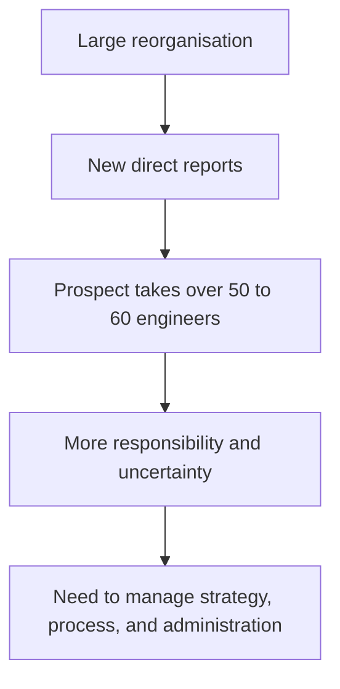
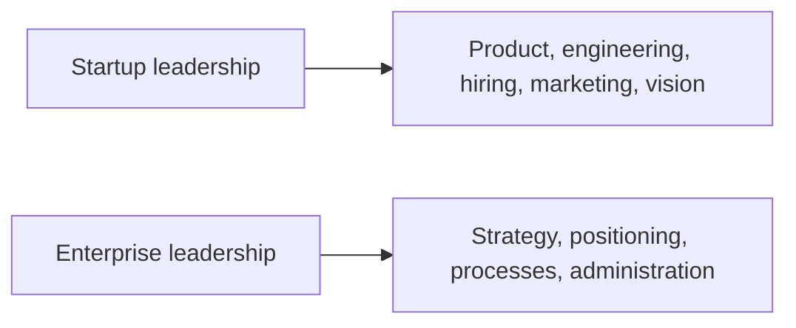

# Call 3: Introductory Call

## Simple Summary

This is mostly an introductory and relationship-building conversation. The prospect recently went through a major reorganisation and has taken responsibility for a much larger engineering function.

There is little direct discussion of a financial workflow or a specific automation problem in the available transcript.

## What Changed for the Prospect?

The prospect previously ran a startup. After the reorganisation, many more direct reports now report to them, bringing the engineering organisation to roughly 50 to 60 people in addition to the prospect's existing team.

The prospect describes the change as stressful because a large reorganisation creates anxiety for the people involved.

## Startup Versus Large Enterprise

The prospect contrasts two working environments.

### Running a startup

At a startup, the focus is strongly connected to the product. The founder or leader works across many areas:

- Engineering
- Hiring
- Marketing
- Product
- Company vision

The work is broad and directly tied to whether the product succeeds.

### Working in a large enterprise

In a large company, product and delivery are only part of the job. More time goes into:

- Strategy
- Positioning
- Process design
- Mapping how work should happen
- Administration

The prospect says this administrative work can feel tiring compared with the direct product focus of a startup.

## What Has Improved?

Despite the pressure, the prospect says the organisation has changed substantially over about 18 months.

The organisation moved from having little familiarity with container technology to having a more modern engineering platform, including:

- Infrastructure as code
- CI/CD pipelines
- Agentic coding
- Several strong projects deployed across the firm
- A reliable engineering team

In simple terms, the prospect has helped turn a less mature engineering organisation into one with modern development practices and a stronger technical foundation.

## What Is the Business Relevance?

This transcript gives background about a possible decision-maker:

- They have broad responsibility.
- They understand technology and organisational change.
- They care about processes, not only products.
- They are experiencing the burden of administrative work at scale.

However, the excerpt does not yet identify a concrete workflow that Ylookup could automate. It should therefore be treated as context for a relationship, not as evidence of a specific customer pain point.

## Main Takeaway

The call is primarily about building rapport and understanding the prospect's new role. The clearest theme is the shift from hands-on product work to managing strategy, processes, and administration across a much larger organisation.

This transcript covers roughly the first half of the call. The missing portion may contain the actual business discussion or workflow details.
