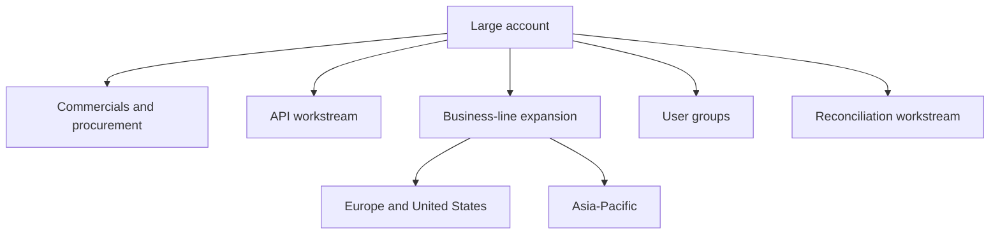
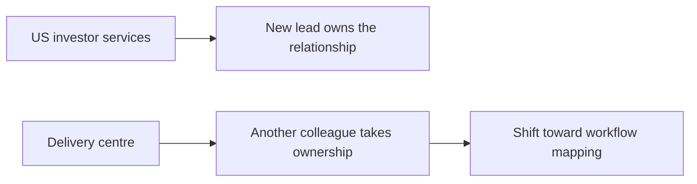

# Call 4: Internal Account Coverage

> **Internal-only warning:** This is an internal Ylookup conversation, not a client meeting. It discusses account ownership, territories, staffing, and commercial strategy. Review before circulating it outside the company.

## Simple Summary

The speakers are deciding who should own different customer relationships and workstreams across regions and business areas.

They are trying to balance three things:

- Clear ownership of each account
- Enough capacity to handle the work
- Continued relationship coverage when more than one person is involved



## The Proposed Ownership Model

One speaker proposes splitting the largest account into several responsibilities:

- One person owns commercial discussions, procurement, and the API workstream.
- Another person leads business-line expansion in Europe and the United States.
- The first person leads business-line expansion in Asia-Pacific.
- A third colleague joins when the discussion is specifically about user groups.

The Asia-Pacific assignment is partly a capacity decision because the region is expected to require a large amount of work.

## The US Investor Services Change

The proposed change concerns US investor services. One speaker suggests that the other person should take responsibility for this area.

To make room for that responsibility, the delivery centre would be handed to another colleague. That colleague would reset its goals so the team focuses more on workflow mapping rather than only on user expansion and activation.



The second speaker agrees and says there is already a daily call with the relevant team, which makes it easier to bring the new colleague into the work.

## Primary and Secondary Relationship Coverage

The proposed model keeps one person as the primary relationship owner, but asks the other person to maintain a secondary relationship where practical.

That means:

```text
Primary owner -> responsible for the account day to day
Secondary owner -> stays informed and joins important conversations
```

The goal is to avoid having a customer relationship depend on only one person. It also makes it easier for another team member to step in when a new opportunity or issue appears.

## Regional Ownership

The suggested regional arrangement is:

- United States: primarily owned by one person
- Asia-Pacific: primarily owned by the other person
- Europe: temporarily owned by the first person while the arrangement develops

The speakers expect to review the arrangement as the business grows.

## The Longer-Term Principle

The conversation ends with a rule for new sectors, such as real estate: once a person has helped establish the sector, they should continue owning it rather than handing it over immediately.

This is intended to preserve continuity and accountability as the business expands.

## What This Call Does Not Show

This is not a description of a customer's operational workflow. It does not provide evidence about:

- How a fund administrator prepares a NAV
- How a finance team processes documents
- A specific customer pain point
- A product feature or proof of concept

Its value is commercial and organisational: it shows how Ylookup thinks about account coverage, regional territories, workstream ownership, and capacity.

## Main Takeaway

The speakers are designing a shared account-ownership model. Each major workstream gets a clear lead, regions are divided between people, and secondary relationship coverage is maintained so customer knowledge is not concentrated in one person.

This transcript covers roughly the first half of the call. The later portion may contain additional ownership decisions.
